# shift management app Requirements definition document

## Purpose and scope

### Purpose

While I was working as Food truck driver, I realized manager was hassle to make shift calendar because manager had 4 store(Truck or trailer) and approximately 20 part-time-worker. therefore, I have decided to make web-app which can solve this kind of situation. And also, I thought it could be portfolio.

### Scope

This application covers not only covers shift management, but also it covers user and work location management which are related to shift management.

## Work requirements

These work are expected as a shift management.

| Work | Description | PIC | Covered by app |
| - | - | - | - |
| Provide personal information | When employees are hired, they have to provide some information such as home address, and bank information. | Employee | Yes |
| Set working conditions | When employees are hired, managers have to set some information such as employment type and wage. Sometime they have to store some images(Passport and VISA). | Manager | Yes |
| Worklocation | Managers have to add information about their store. It is going to be helpful when they make shifts especially they have 2 and more stores. | Manager | Yes |
| Shift request | Before the deadline, employees have to send shift preference. | Employee | TBD |
| Shift creation | Managers make shift based on employees preference. | Manager | Yes |
| Shift Confirmation | When managers finish to make shift, workers are able to see own shift | Both | Yes |
| Message | Users can get notification when new shift is created, and also they can send message to other users. | Both | TBD |

## Work flow

This is a typical flow to make shifts.
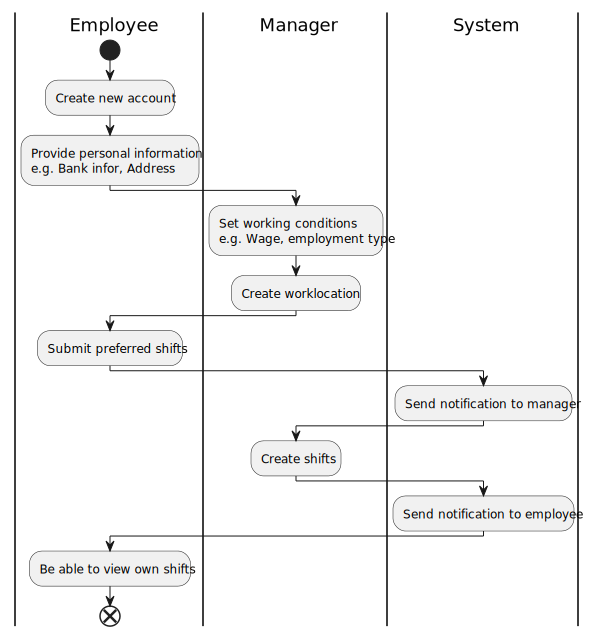

## Features

### Page layout

Each page has a common header that make users easy to access the main pages. header has 3 areas.

| area | Description |
| - | - |
| Web-page Icon | When it is clicked, redirect to top-page. |
| Quick access | There is few links which can redirect to page. |
| User icon | When it is clicked, dropdown will be appeared. |

#### User icon dropdown

When user icon is clicked, dropdown will be appeared. It shows 2 different depend on user log-in or not.

| When | Link1 | Link2 |
| - | - | - |
| User login | Profile | Log-out |
| User doesn't login | Log-in | Sign-up |

### User creation/update

#### Sign-up

When manager hire new person, manager has to make him/her create account. For now, they are required simple-information such as email, name, and passward.

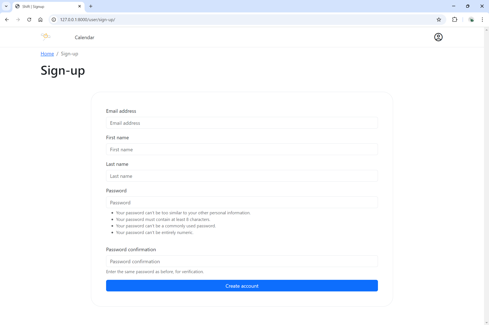

#### Profile(Update information)

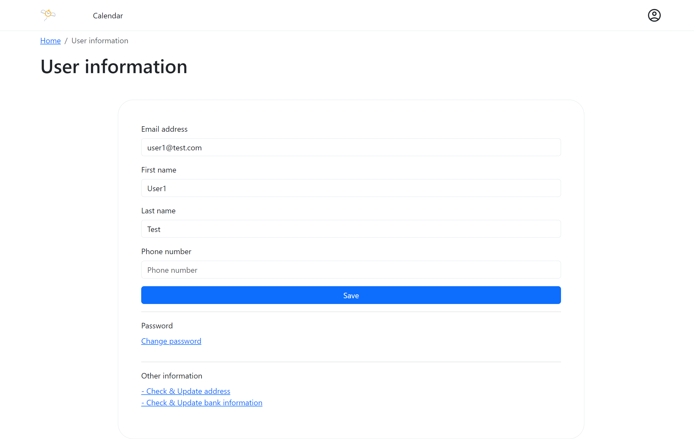

#### Address

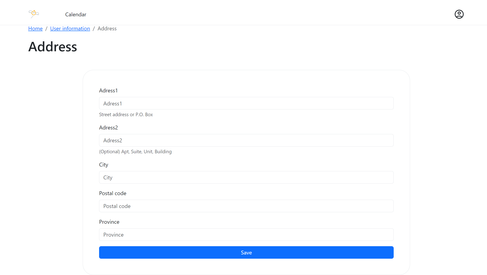

#### Bank information

Every input accepts only numbers and they have maximum.

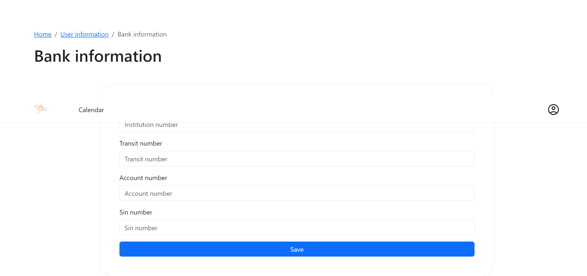

### Management

#### User management

Some users who have access to this page can view and edit user information.

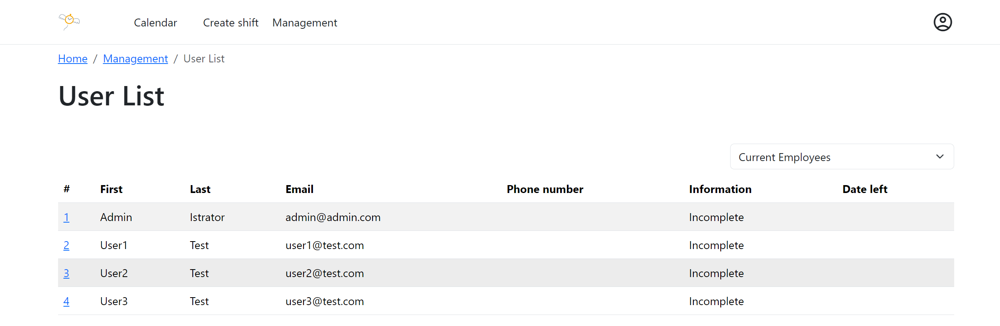

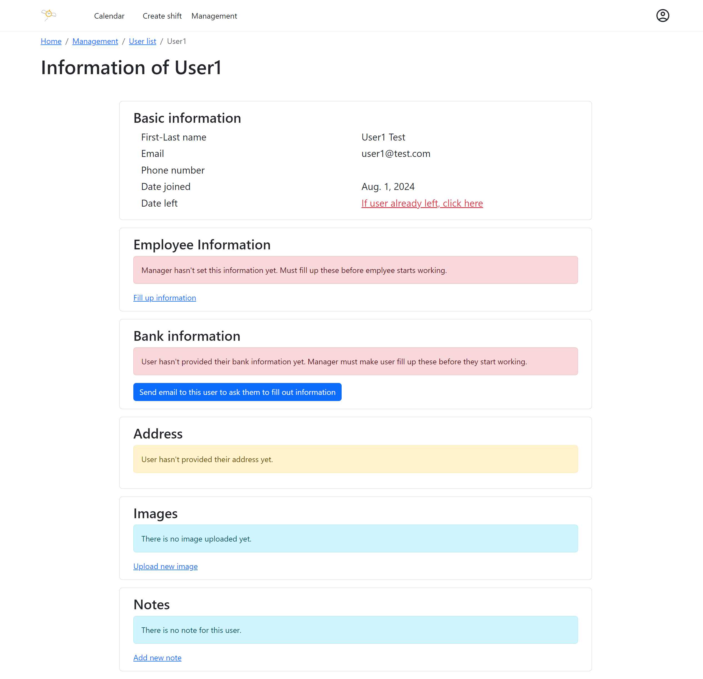

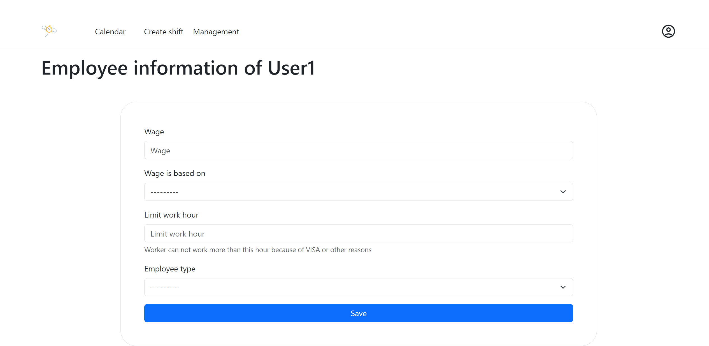

### Shift

#### Creation (For manager)

Manager can...
- Make shift calendar based on arbitrary date range.
- Make any number of shift calendar
- Allocate arbitrary user(Employee).

Manager cannot(will have error)...
- Try to allocate same user on same day
- Try to make shift calendar with date range which doesn't exist.

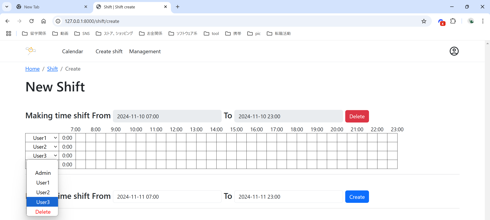

How to create shift
- When manager click any cell, it starts to show popup and cell starts to have color.
- While showing popup, manager cannot click cell which belong to other user.
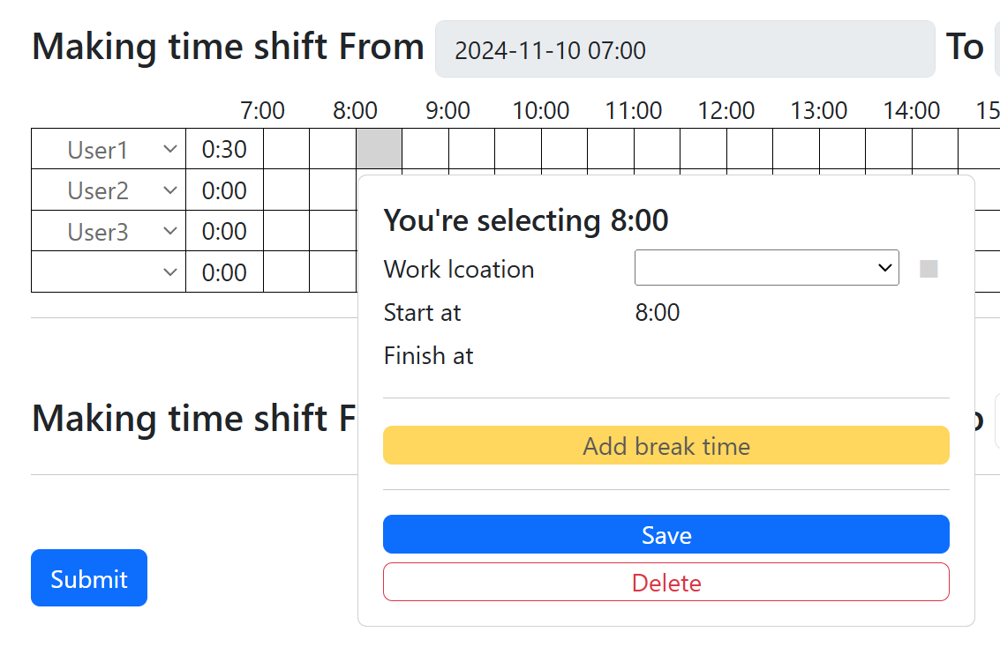

- After that, manager can click cell which means end of shift.
- It shows total working hour automatically.
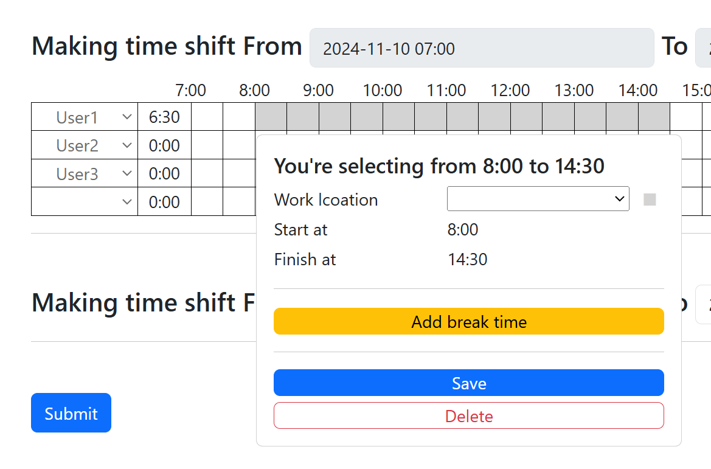

- Manager can change store location.
- After changing, cell color turn to another color.
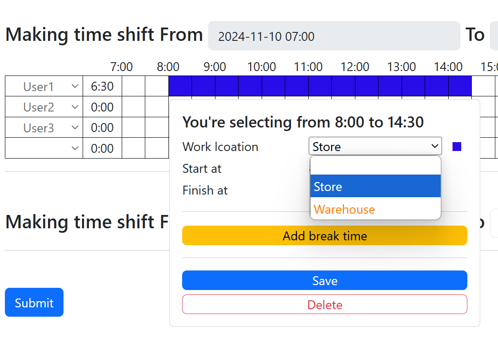

- When manager clicks `Add break time`, manager can add break time.
- Manager can't click cell which belong to other shift.
- When manager clicks cell, it turn to yellow cel. it means break time.
- When manager clicks yellow cell, it turn it back to normal shift cell.
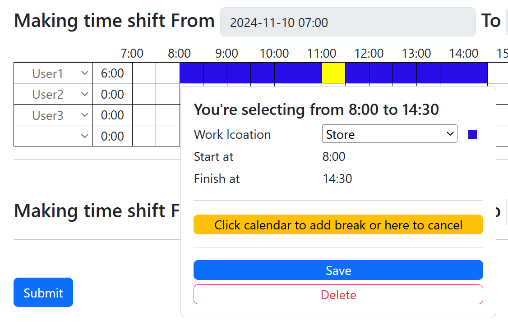

- Manager can finish editing to click `save`.
- Manager can resume editing to click colored cell (it starts to show popup again).
 
- Manager can make complex shift by making use of these functions.
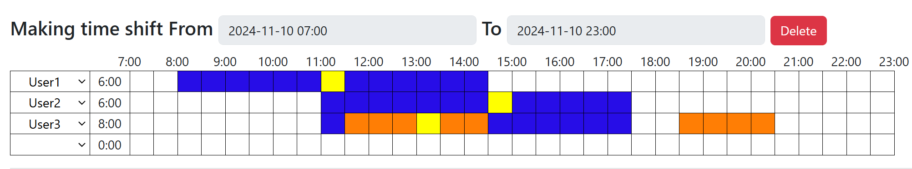

#### View (every user)

Every user (employee) can see their shift after Manger allocate them.
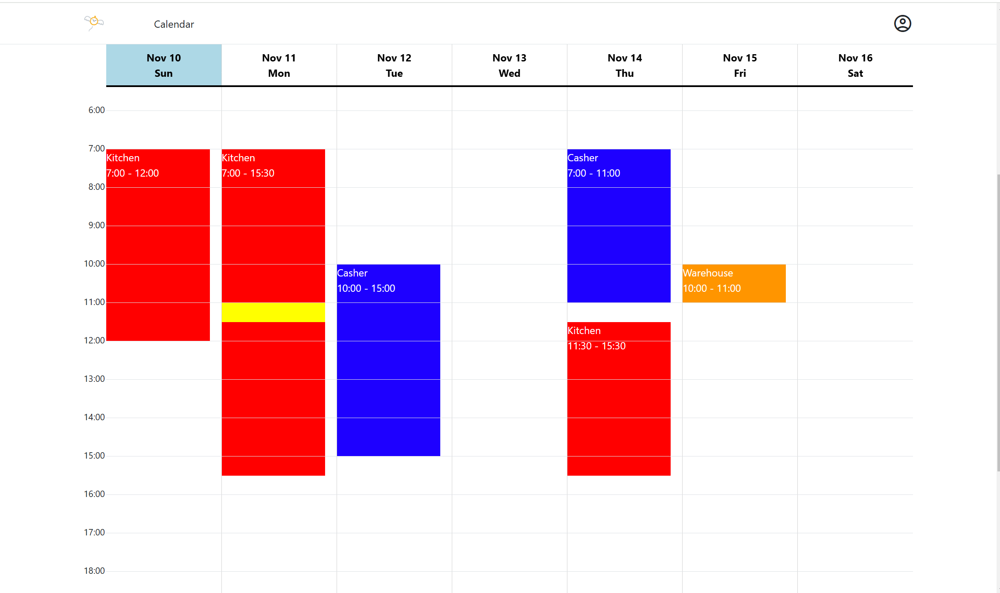